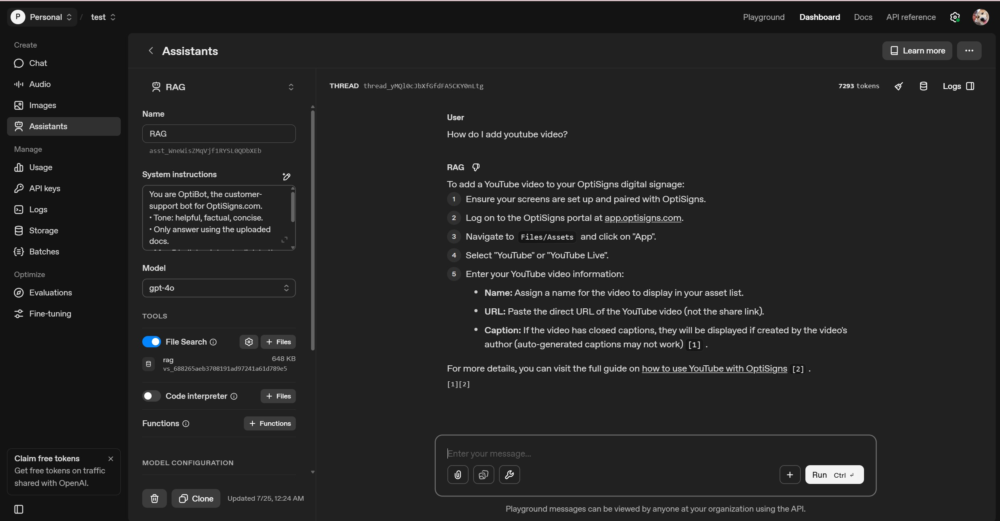

# RAG Test – 
## ⚙️ Setup
1. Clone this repo:                     ```bash
                                        git clone 
                                        cd rag-bot
2. Download the library:                pip install -r requirements.txt
3. Add your API key:                    OPENAI_API_KEY=sk-xxxx

## Docker Setup
1.Build image:                          docker build -t bot-daily .
2.Run manually:                         docker run --rm --env-file .env bot-daily

## Schedule Daily on DigitalOcean
1.SSH into your Droplet:                ssh root@<your-server-ip>
2.Create crontab:                       crontab -e
3.Paste:                                0 3 * * * docker run --rm --env-file /root/chunking-doc/.env bot-daily >> /root/daily_job.log 2>&1

## 📄 Logs

- **Job Output Log**  
  Saved daily at: `/root/daily_job.log`  
  Includes full stdout of scraping, chunking, and uploading process.

- **Summary JSON Log**  
  `/root/chunking-doc/job_log.json`  
  Lists which articles were added / updated / skipped in last run.

#Playground Test

